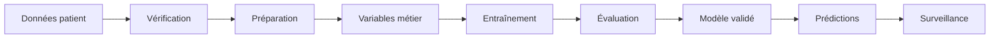

# MedRisk Health Analytics


MedRisk Health Analytics est un projet pédagogique de Machine Learning consacré
à l’estimation du risque de diabète à partir de données de patients.

Son objectif est de montrer comment passer d’un fichier de données médicales à un
modèle suivi et utilisable sur Databricks, sans disperser la logique dans de
nombreux notebooks.

> Ce projet sert à l’apprentissage et à l’analyse. Il ne remplace pas un avis
> médical et ne doit pas être utilisé seul pour poser un diagnostic.

## Ce que fait le projet

Le fichier source contient des informations comme l’âge, la glycémie, l’IMC, la
pression artérielle, le cholestérol et certaines habitudes de vie.



À chaque étape, le projet répond à une question :

1. **Les données sont-elles exploitables ?** Il contrôle les colonnes, les
   doublons, les valeurs manquantes et la variable à prédire.
2. **Peut-on mieux représenter le risque ?** Il calcule des variables métier à
   partir des mesures disponibles.
3. **Le modèle apprend-il correctement ?** Il sépare les données utilisées pour
   apprendre de celles utilisées pour évaluer.
4. **Le nouveau modèle mérite-t-il d’être utilisé ?** Il doit dépasser des seuils
   de qualité avant de devenir le modèle `Champion`.
5. **Les nouvelles données ressemblent-elles encore aux données historiques ?**
   Une dernière étape mesure leur dérive.

## Pourquoi en faire un package Python ?

Dans un projet composé uniquement de notebooks, une même transformation finit
souvent par être recopiée à plusieurs endroits. Deux notebooks peuvent alors
produire des résultats différents sans que cela soit visible.

Ici, la logique est regroupée dans `medrisk_health_analytics`. Les notebooks
appellent les mêmes classes pendant la préparation, l’entraînement et la
prédiction. Le comportement devient plus facile à comprendre, tester et réutiliser.

La création des variables métier tient par exemple en quelques lignes :

```python
from medrisk_health_analytics import FeatureEngineeringPipeline

pipeline = FeatureEngineeringPipeline()
patient_features = pipeline.transform(patient_data)
```

## Les classes principales

| Classe | Rôle expliqué simplement |
|---|---|
| `DatasetLoader` | Charge un fichier, un DataFrame ou une table Databricks |
| `DatasetAnalyzer` | Résume la taille, les types, les valeurs manquantes et les doublons |
| `DatasetPreprocessor` | Nettoie les données de manière reproductible |
| `FeatureEngineeringPipeline` | Construit les variables médicales et comportementales |
| `ModelTrainer` | Entraîne un modèle et conserve son historique |
| `ModelEvaluator` | Mesure la qualité du modèle |
| `ModelPredictor` | Recharge un modèle validé et produit des prédictions |

## Exemple simple

```python
from medrisk_health_analytics import (
    DatasetAnalyzer,
    DatasetLoader,
    DatasetPreprocessor,
    FeatureEngineeringPipeline,
)

data = DatasetLoader().load("data/patient.csv")

analysis = DatasetAnalyzer(
    target_column="diagnosed_diabetes"
).analyze(data)

print(f"Nombre de patients : {analysis.rows}")
print(f"Nombre de doublons : {analysis.duplicate_rows}")

clean_data = DatasetPreprocessor().transform(data)

features = FeatureEngineeringPipeline().transform(
    clean_data,
    target_column="diagnosed_diabetes",
)
```

Cet exemple examine les données et construit les variables. Le workflow
Databricks prend ensuite en charge l’entraînement, l’enregistrement du modèle et
les prédictions.

## Les variables métier

Une mesure isolée ne suffit pas toujours à représenter un risque. Le projet
combine donc plusieurs observations.

| Variable créée | Interprétation |
|---|---|
| `pulse_pressure` | Écart entre les pressions systolique et diastolique |
| `mean_arterial_pressure` | Estimation de la pression artérielle moyenne |
| `triglyceride_hdl_ratio` | Relation entre triglycérides et bon cholestérol |
| `tyg_index` | Indicateur associé à la résistance à l’insuline |
| `tyg_bmi_index` | Association de l’indice TyG et de l’IMC |
| `medical_history_burden` | Nombre d’antécédents médicaux importants |
| `activity_deficit_ratio` | Écart par rapport au niveau d’activité de référence |
| `sleep_deviation_hours` | Écart par rapport à huit heures de sommeil |

La cible et les informations directement liées au diagnostic sont retirées des
entrées du modèle. Cela évite que le modèle apprenne la réponse au lieu des
facteurs de risque.

Les formules sont expliquées dans
[FEATURE_ENGINEERING.md](docs/FEATURE_ENGINEERING.md).

## Comment le modèle est choisi

Le projet sait entraîner une régression logistique, une forêt aléatoire, un
Gradient Boosting, XGBoost, LightGBM ou CatBoost.

Un modèle entraîné n’est pas automatiquement considéré comme bon. Il est testé
sur des patients qui n’ont pas participé à son apprentissage. Si ses résultats
sont insuffisants, le workflow s’arrête et le modèle déjà utilisé reste en place.

La vue principale conserve six métriques complémentaires : ROC AUC, Average
Precision, sensibilité (recall), spécificité, MCC et score de Brier. Le rapport
d’évaluation contient aussi F1, balanced accuracy, précision, valeur prédictive
négative et matrice de confusion.

## Le rôle de MLflow

MLflow joue le rôle de carnet d’expériences. Pour chaque entraînement, il conserve :

- la configuration et la version du package ;
- la provenance des données ;
- les résultats du modèle ;
- la liste des variables ;
- le modèle et sa préparation ;
- le format des données attendu ;
- la version enregistrée dans Unity Catalog.

Le prétraitement voyage avec le modèle. Une prédiction recharge donc un objet
complet au lieu d’essayer de reconstruire manuellement les mêmes étapes.

## Le parcours Databricks

Quatre petits notebooks orchestrent le projet :

| Étape | Notebook | Résultat |
|---:|---|---|
| 1 | `01_prepare_data.py` | Données contrôlées, features, train et holdout |
| 2 | `02_train_validate_promote.py` | Candidat évalué puis éventuellement promu |
| 3 | `03_batch_inference.py` | Prédictions enregistrées dans Delta |
| 4 | `04_monitor_data_drift.py` | Dérive des variables enregistrée dans Delta |

Une erreur bloque les étapes suivantes. Un modèle ne peut donc pas être promu si
les données ou son évaluation sont invalides.

Les données du développement sont regroupées dans :

```text
workspace.mlops_dev
```

On y trouve les données brutes, les features, les jeux d’apprentissage et de
test, les prédictions et les mesures de surveillance.

## Lancer le projet

```bash
databricks bundle validate -t dev
databricks bundle deploy -t dev
databricks bundle run medrisk_classification_pipeline -t dev
```

- `validate` vérifie la configuration ;
- `deploy` construit le package et met à jour le job ;
- `run` exécute tout le parcours.

Le package est installé automatiquement dans l’environnement Serverless. Les
notebooks n’ont donc pas besoin de `%pip install`.

Pour vérifier le code localement :

```bash
poetry install
make check
```

## Organisation du projet

```text
Medrisk-Health-Analytics/
├── src/medrisk_health_analytics/   logique Python réutilisable
├── tests/                          contrôles automatisés
├── notebooks/                      étapes Databricks
├── resources/                      définition du job
├── docs/                           explications détaillées
├── data/                           données locales non versionnées
├── databricks.yml                  configuration Databricks
└── pyproject.toml                  package et dépendances
```

## Documentation complémentaire

- [Architecture MLOps Databricks](docs/MLOPS_DATABRICKS.md)
- [Variables métier](docs/FEATURE_ENGINEERING.md)
- [Guide des notebooks](docs/NOTEBOOKS.md)
- [Audit technique](docs/AUDIT.md)
- [Guide de contribution](docs/CONTRIBUTING.md)
- [Sécurité](docs/SECURITY.md)

## Limites à connaître

Le workflow actuel est validé pour l’environnement de développement et les
100 000 lignes du jeu de démonstration. Certaines étapes utilisent Pandas ; un
volume beaucoup plus important demanderait un entraînement distribué.

Le jeu de scoring actuel démontre le fonctionnement du pipeline. Dans un projet
réel, il doit être remplacé par de nouvelles données indépendantes. Lorsque les
diagnostics réels deviennent disponibles, ils doivent être comparés aux
prédictions pour suivre la performance dans le temps.

Enfin, un bon résultat statistique ne constitue pas une validation clinique. Les
variables, seuils, biais possibles et conditions d’utilisation doivent être
évalués avec des spécialistes avant tout usage concernant des patients.

## Licence

Ce projet est distribué sous licence MIT. Consultez [LICENSE](LICENSE).
