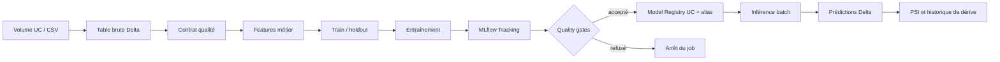

# Architecture MLOps Databricks

## Objectif de production

Le système entraîne un classifieur de risque de diabète, refuse les candidats qui
échouent aux seuils du holdout, publie la version acceptée dans Models in Unity
Catalog et exécute une inférence batch reproductible. Le package Python porte la
logique testable; les notebooks restent des adaptateurs Databricks courts.



## Responsabilités des quatre tâches

1. `prepare_data` copie la source dans Delta, nettoie les données, applique un
   contrat bloquant, construit les variables métier et matérialise train,
   holdout et scoring. La graine du split est configurée.
2. `train_validate_promote` entraîne sur train, conserve une validation interne,
   journalise paramètres, cinq métriques utiles, artefacts, signature et exemple
   dans MLflow. Le holdout séparé décide de la promotion.
3. `batch_inference` charge exclusivement `models:/...@Champion`. Le modèle PyFunc
   transporte le préprocesseur et le modèle, ce qui protège la parité
   entraînement/inférence.
4. `monitor_data_drift` compare les entrées de scoring à la référence train avec
   le Population Stability Index et ajoute le résultat dans une table Delta.

## Matrice des principes

| Principe | Implémentation | Preuve |
|---|---|---|
| Code versionné et installable | layout `src`, wheel Poetry, lock file | `pyproject.toml`, CI wheel smoke test |
| Infrastructure déclarative | bundle et job versionnés | `databricks.yml`, `resources/jobs.yml` |
| Environnement déployable | cible dev reliée exclusivement à `workspace.mlops_dev` | variables du target dev |
| Données gouvernées | Volume et tables Delta en Unity Catalog | propriétés `RuntimeSettings` |
| Contrat des données | schéma minimal, cible binaire, valeurs manquantes, doublons, infinis, IDs | `DataQualityValidator` |
| Prévention de fuite | cible et variables post-diagnostic exclues | `preprocessing/leakage.py` et tests |
| Reproductibilité | graine, configuration Pydantic, dépendances bornées, artefacts MLflow | `TrainingConfig`, `poetry.lock` |
| Traçabilité | run, paramètres, tags de source et environnement, modèle, signature | `boosting/training/trainer.py` |
| Validation hors entraînement | table holdout séparée et seuils ROC AUC/recall | notebook 02 |
| Gouvernance du modèle | nom UC à trois niveaux et alias atomique | `set_model_alias` |
| Parité train/serve | préprocesseur et estimateur dans un seul `PythonModel` | `BoostingPyFuncModel` |
| Orchestration | dépendances, file d’attente, concurrence limitée, serverless | job bundle |
| Observabilité | métriques de qualité et PSI historisés dans Delta | notebook 01 et 04 |
| Qualité logicielle | Ruff, Black, mypy, tests multi-version, audit dépendances | workflows GitHub |
| Livraison contrôlée | validation, déploiement et exécution manuels par environnement GitHub | `databricks-deploy.yml` |

## Contrats et seuils

Le contrat d’entrée est bloquant. Une source vide, une colonne obligatoire absente,
une cible différente de `{0, 1}`, une valeur infinie, un doublon ou un taux de
valeurs manquantes supérieur à `MEDRISK_MAX_MISSING_RATIO` arrête l’entraînement.
La limite vaut 5 % par défaut.

La promotion exige par défaut `holdout_roc_auc >= 0.70` et
`holdout_recall >= 0.60`. Ces valeurs servent de garde-fou technique; le métier et
les responsables cliniques doivent approuver les seuils avant production.

Le contrôle de dérive utilise un PSI de 0,20 par défaut. Les résultats sont
conservés dans `workspace.mlops_dev.feature_drift_metrics`. En développement,
la dérive est signalée sans bloquer l’inférence. `MEDRISK_FAIL_ON_DRIFT=true`
transforme ce contrôle en quality gate.

## Promotion et rollback

L’alias `Champion` n’est déplacé qu’après la réussite du holdout. Une version
rejetée reste traçable dans MLflow mais ne reçoit pas l’alias. Pour revenir à une
version connue :

```python
from medrisk_health_analytics.mlflow import set_model_alias

set_model_alias(
    registered_model_name="workspace.mlops_prd.boosting_risk_model",
    version="VERSION_VALIDEE",
    alias="Champion",
)
```

Le rollback change un pointeur du registre; il ne reconstruit pas le modèle. Il
faut ensuite relancer la tâche d’inférence et vérifier la table de prédictions.

## Exploitation et incidents

- Échec de `prepare_data` : consulter les violations du contrat, corriger la
  source puis relancer depuis cette tâche. Ne pas contourner le contrôle.
- Échec de promotion : comparer le run candidat au Champion dans MLflow et
  analyser le holdout. Le modèle en service reste inchangé.
- Dérive PSI : identifier les variables en tête de la table de monitoring,
  vérifier changement de population et qualité d’ingestion, puis décider si un
  réentraînement est justifié.
- Échec d’inférence : vérifier la signature MLflow, les colonnes attendues et la
  disponibilité de l’alias. Les entrées invalides ne doivent pas être forcées.

Les historiques des Lakeflow Jobs, MLflow et tables Delta constituent les trois
niveaux de preuve : exécution, modèle et données.

## CI/CD et secrets

La CI locale ne nécessite aucun secret Databricks. Le workflow de déploiement est
manuel et utilise les GitHub Environments `dev`, `stg`, `prd`. Chacun doit contenir
`DATABRICKS_HOST` et `DATABRICKS_TOKEN`; la production doit imposer des reviewers.
Une identité de service avec les privilèges minimaux est préférable à un jeton
personnel. Le workflow valide le bundle avant le déploiement et peut exécuter le
pipeline après celui-ci.

La cible actuellement qualifiée de bout en bout est `dev`, reliée à
`workspace.mlops_dev`; elle correspond aux valeurs Pydantic par défaut et ne
dépend d’aucun widget. Les cibles `stg` et `prd` décrivent les futurs espaces de
déploiement, mais ne doivent pas être exécutées avant d’avoir activé les variables
d’environnement des Lakeflow Jobs Serverless dans les previews du workspace, ou
d’avoir migré l’orchestration vers des tâches Python wheel paramétrées. Elles ne
sont donc pas proposées par le workflow GitHub actuel.

## Limites assumées

- Les conversions `toPandas()` conviennent aux 100 000 lignes actuelles. Pour des
  volumes dépassant la mémoire du driver, migrer la préparation et l’entraînement
  vers Spark ML, XGBoost distribué ou un échantillonnage contrôlé.
- Le lot de scoring de démonstration provient du holdout. En production, il doit
  être remplacé par une source indépendante et horodatée.
- Le PSI surveille les covariables sans vérité terrain. Lorsque les diagnostics
  réels arrivent, les joindre aux prédictions pour suivre recall, précision,
  calibration et performance par sous-population.
- Le projet livre une inférence batch. Un endpoint Model Serving, ses inference
  tables, SLA de latence et alertes ne sont nécessaires que pour un cas temps réel.
- La validation clinique, l’équité, la confidentialité et l’approbation
  réglementaire dépendent du contexte d’utilisation; aucune suite technique ne
  peut les remplacer.
